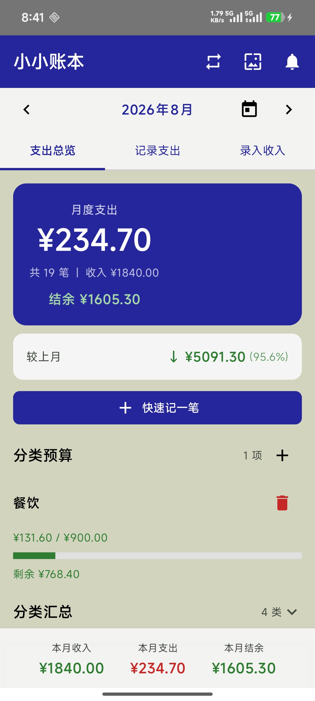
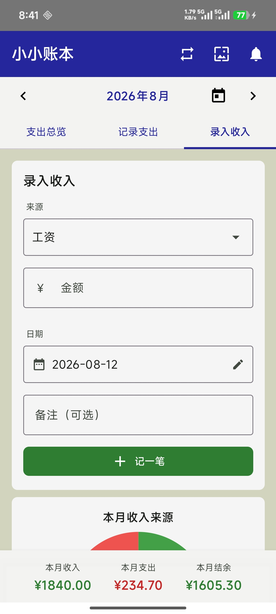
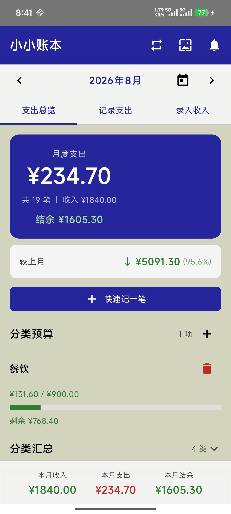
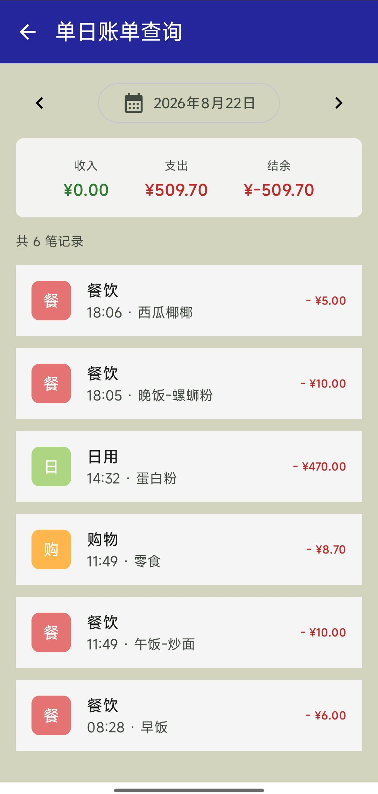
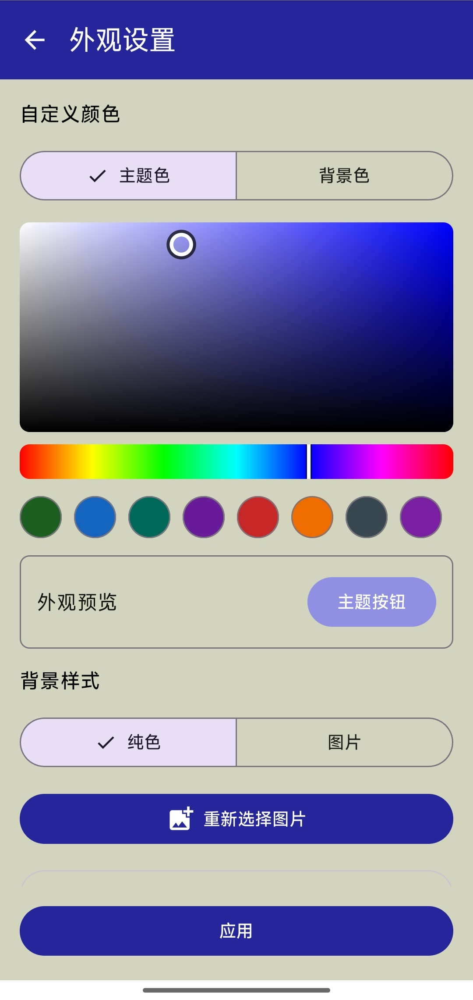

# 小小账本

一款使用 Kotlin 与 Jetpack Compose 开发的本地记账应用，支持收支记录、月度统计、单日查询、分类预算、周期记账、提醒设置与个性化外观。项目以 Room 作为本地数据源，通过 Repository、ViewModel 和 Flow 驱动界面更新。

## 功能概览

- 记录、编辑和删除支出与收入
- 按月份查看账单、收入、支出和结余
- 查询指定日期的收入、支出、结余与账单明细
- 按分类汇总支出并显示预算进度
- 设置月度分类预算和超支状态
- 创建每周或每月自动执行的周期账目
- 删除账目后通过 Snackbar 撤销
- 设置中午和晚间记账提醒
- 自定义主题色、背景色和裁剪后的背景图片
- 通过“更多功能”入口统一管理单日查询、周期记账、提醒和外观设置
- 支持 Room 数据库版本迁移

## 应用截图

| 月度总览 | 记录支出 | 录入收入 |
| --- | --- | --- |
|  |  |  |
| 查看当月收支、结余和分类情况 | 记录支出并管理支出明细 | 记录收入并管理收入明细 |

| 分类预算 | 更多功能 | 单日账单查询 |
| --- | --- | --- |
|  |  |  |
| 设置各分类的月度预算与超支状态 | 集中进入查询、周期记账、提醒和外观设置 | 按日期查看收入、支出、结余和账单明细 |

| 周期记账 | 记账提醒 | 外观设置 |
| --- | --- | --- |
|  |  |  |
| 创建每周或每月自动执行的账目 | 设置每日记账提醒时间 | 自定义主题色、背景色和背景图片 |

## 技术栈

- Kotlin、Coroutines、Flow、StateFlow、SharedFlow
- Jetpack Compose、Material 3、Navigation 3、ViewModel
- Room、Migration、DataStore Preferences
- WorkManager、系统通知与定时提醒
- AndroidX SplashScreen
- Android Photo Picker 与图片裁剪
- JUnit、Room 仪器测试

## 项目架构

```text
Compose UI / Navigation 3
    │ 用户事件与页面导航
    ▼
ViewModel
    │ 业务调用与状态聚合
    ▼
LedgerRepository
    │
    ▼
Room / DAO / Flow

AppearancePreferences ── DataStore Preferences
BackgroundPreferences ── SharedPreferences / 本地图片
RecurringWorkScheduler ── WorkManager
ReminderScheduler ─────── 系统通知与定时任务
```

主要目录：

```text
app/src/main/java/com/example/billkeeper/
├── background/    # 周期任务、背景与外观设置
├── data/          # Entity、DAO、Database、Repository 和数据模型
├── domain/        # 周期账目等领域规则
├── notification/  # 通知、提醒计划与广播接收器
├── ui/            # Compose 页面、Navigation 3、组件和主题
└── viewmodel/     # UI 状态、Flow 组合与用户操作
```

## 核心实现

### Navigation 3 与更多功能

应用使用 Navigation 3 的 `NavDisplay`、`rememberNavBackStack` 和类型安全目的地管理页面。主页通过“更多功能”进入二级页面，再分别进入单日账单查询、周期记账、记账提醒和外观设置，顶部返回按钮与系统返回手势共用同一返回栈。

### 单日账单查询

用户可以选择日期或切换前后一天，查看当天收入、支出、结余和按时间倒序排列的收支明细。查询使用本地时区中“当天零点至次日零点”的左闭右开区间，能够正确处理夏令时和日期边界。

### 月度查询与状态聚合

月份变化后，ViewModel 使用 `flatMapLatest` 取消旧月份查询并订阅新时间范围。查询采用“本月第一天至下月第一天”的左闭右开区间，避免月底、闰年和最后一毫秒的边界错误。账单、收入、分类汇总和上月支出通过 `combine` 聚合为统一的 `MonthlyUiState`。

### 分类预算

预算按年份、月份和分类保存。ViewModel 将预算 Flow 与分类支出 Flow 组合，计算已支出金额、剩余金额、使用比例和超支状态，数据库数据改变后界面自动刷新。

### 周期记账

周期账目支持每周和每月规则。WorkManager 负责后台检查到期任务，数据库事务负责生成账目并更新下次执行时间，避免任务只完成一半。时间计算逻辑可通过固定 `Clock` 进行稳定测试。

### 删除撤销

删除成功后，ViewModel 通过 `SharedFlow` 发送一次性 Snackbar 事件并暂存被删除对象。用户点击撤销后重新写入 Room，相关 Flow 发出新数据并驱动列表恢复。

### 数据库迁移

项目使用显式 Room Migration 升级数据库结构，保留已有用户数据，并通过仪器测试验证旧版本数据库能够正确迁移到新版本。

## 测试

JVM 单元测试位于 `app/src/test/`，覆盖：

- 金额模型和表单校验
- 月份范围与时区转换
- 单日查询的本地午夜与夏令时边界
- 周期日期规则
- 提醒调度规则

Android 仪器测试位于 `app/src/androidTest/`，覆盖：

- Room 数据库迁移
- 周期账目事务执行

运行 JVM 单元测试：

```powershell
.\gradlew.bat testDebugUnitTest
```

连接模拟器或真机后运行仪器测试：

```powershell
.\gradlew.bat connectedDebugAndroidTest
```

## 运行项目

环境要求：

- Android Studio
- JDK 17
- Android SDK 36.1（`compileSdk 36`、`compileSdkMinor 1`）
- 最低 Android 版本：Android 8.0（API 26）

使用 Android Studio 打开项目根目录，完成 Gradle Sync 后运行 `app` 配置。也可以在项目根目录执行：

```powershell
.\gradlew.bat assembleDebug
```

生成的 Debug APK 位于：

```text
app/build/outputs/apk/debug/app-debug.apk
```

## 后续计划

1. 新增应用内版本检查与更新提示
2. 将数据仓库拆分为接口和不同实现
   - `LedgerRepository`：接口
   - `RoomLedgerRepository`：Room 真实实现
   - `FakeLedgerRepository`：测试实现
